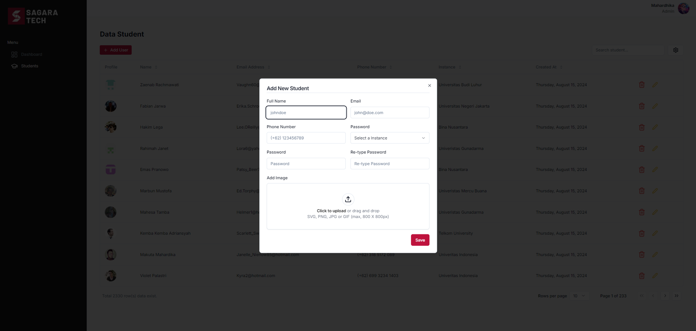

# Technical Test Internship Sagara Technology



## TechStack

- `Next JS`

- `Typescript`

- `Shadcn UI`

- `React Table`

- `Zod`

- `Tailwind css`

- `faker js`

## Feature

- `CRUD student with server action`

- `Search filter`

- `Sorting`

- `Pagination`

- `Responsive`

- `Analytic Dashboard Dynamic`

- `Deploy on Vercel (but action CRUD cannot run in production)`

## How to run this code ?

### Clone repo

```bash
git clone  https://github.com/novalmahardhika/technical-test-sagara-technology.git
```

### Go directory

```bash
cd technical-test-sagara-technology
```

### Install package

```bash
npm i
```

### Run app

```bash
npm run dev
```

## Command

### Generate Seeders

```bash
npm  run db:seed
```
